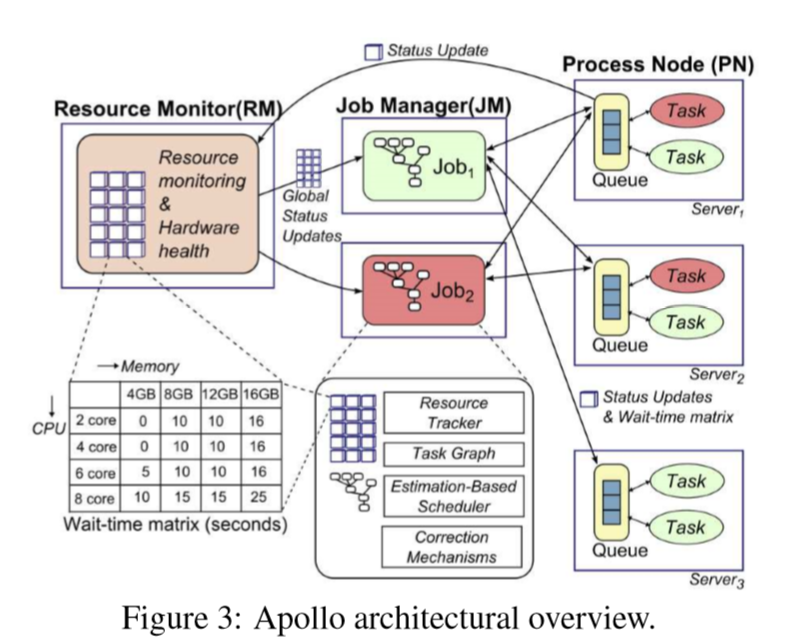

# [Reading] Apollo: Scalable and Coordinated Scheduling for Cloud-Scale Computing

## Problem

Efficiently scheduling data-parallel computation jobs over cloud-scale computing clusters is critical for job performance, system throughput, and resource utilization. It is becoming even more challenging with growing cluster sizes and more complex workloads with diverse characteristics.

## Contribution

### What a scheduler should do?

 A scheduler must 

- scale to make tens of thousands of scheduling decisions per second on a cluster with tens of thousands of servers;
- maintain fair sharing of resources among different users and groups; 
- make high-quality scheduling decisions that take into account factors such as data locality, job characteristics, and server load, to minimize job latencies while utilizing the resources in a cluster fully. 

### Our Contribution

This paper presents Apollo, a highly scalable and coordinated scheduling framework, which has been deployed on production clusters at Microsoft to schedule thousands of computations with millions of tasks efficiently and effectively on tens of thousands of machines daily. The framework performs scheduling decisions **in a distributed manner**, utilizing global cluster information via a loosely coordinated mechanism. Each scheduling decision considers future resource availability and optimizes various performance and system factors together in a single unified model. **Apollo is robust, with means to cope with unexpected system dynamics, and can take advantage of idle system resources gracefully while supplying guaranteed resources when needed.** 

## Apollo's features

- To **balance scalability and scheduling quality**, Apollo adopts a distributed and (loosely) coordinated scheduling framework, in which independent scheduling decisions are made in an optimistic and coordinated manner by incorporating synchronized cluster utilization information. 
- To **achieve high-quality scheduling decisions**, Apollo schedules each task on a server that minimizes the task completion time. 

- To **supply individual schedulers with cluster information**, Apollo introduces a lightweight hardware independent mechanism to advertise load on servers. 
- To **cope with unexpected cluster dynamics, suboptimal estimations, and other abnormal runtime behaviors**, which are facts of life in large-scale clusters, Apollo is made robust through a series of correction mechanisms that dynamically adjust and rectify suboptimal decisions at runtime. 

- To **drive high cluster utilization while maintaining low job latencies**, Apollo introduces opportunistic scheduling, which effectively creates two classes of tasks: regular tasks and opportunistic tasks. 
- To **ensure no service disruption or performance regression** when we roll out Apollo tore place a previous scheduler deployed in production, we designed Apollo to support staged rollout to production clusters and validation at scale. 

## Framework

**A Job Manager (JM)**, also called a scheduler, is assigned to manage the life cycle of each job. 

The global cluster load information used by each JM is provided through the cooperation of two additional entities in the Apollo framework: **a Resource Monitor (RM)** for each cluster and **a Process Node (PN)** on each server. 

**A PN process running on each server** is responsible for managing the local resources on that server and performing local scheduling, while the RM aggregates load information from PNs across the cluster continuously, providing a global view of the cluster status for each JM to make informed scheduling decisions. 

## Performance

We observe that Apollo schedules over 20,000 tasks per second in a production cluster with over 20,000 machines. It also delivers high scheduling quality, with95% of regular tasks experiencing a queuing delay of under 1 second, while achieving consistently high (over 80%) and balanced CPU utilization across the cluster.